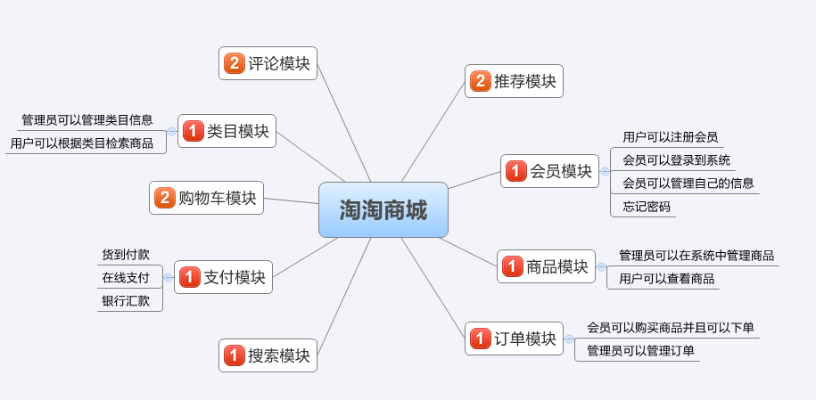
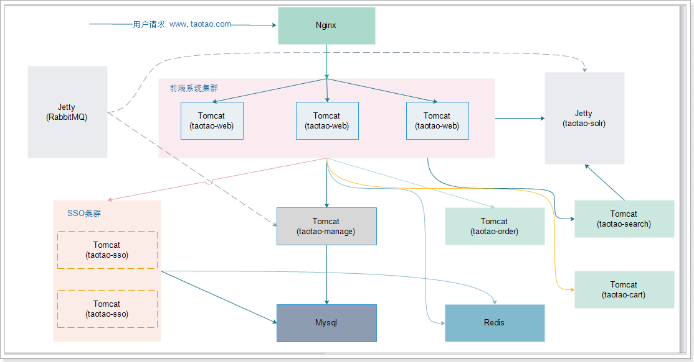

# taotao
## 前言

淘淘网上商城是一个综合性的B2C平台

## 项目介绍

该项目分为前台商城系统和后台管理系统
- 前台用户可以查看推荐商品、进行商品搜索、商品购买、个人信息管理等操作。
- 后台用户可以商品管理、商品分类管理、商品规格参数管理、内容管理、内容分类管理等操作。

### 组织结构

``` lua
taotao
├── taotao-parent -- 所有module的父工程，用于控制依赖版本
├── taotao-common -- 工具类和通用pojo封装
├── taotao-generate -- 用于生成mybatis的mapper和pojo
├── taotao-manager -- 后台管理系统
|    ├── taotao-pojo -- mybatis-generate生成的pojo和example
|    ├── taotao-mapper -- mybatis-generate生成的mapper接口和mapper.xml文件
|    ├── taotao-service -- 后台管理系统业务层
|    └── taotao-web -- 后台管理系统web工程
├── taotao-portal -- 商城前台门户模块
├── taotao-rest -- 商城系统前台rest接口服务
├── taotao-search -- 商城系统前台搜索模块
├── taotao-sso -- 商城系统前台登录注册模块
└── taotao-order -- 商城系统前台登录订单模块
```
### 技术选型

#### 后端技术：
技术 | 名称 
----|----
Spring Framework | 容器  
SpringMVC | MVC框架  
MyBatis | ORM框架  
MyBatis Generator | 代码生成  
PageHelper | MyBatis物理分页插件
Druid | 数据库连接池  
Freemarker | 模板引擎  
Redis | 分布式缓存数据库  
Solr | 分布式全文搜索引擎  
Slf4j | 日志组件  
HttpClient | 远程服务调用客户端  
Jackson | JSON数据解析工具  
Maven | 项目构建管理  

#### 前端技术：
技术 | 名称 
----|----
jQuery | 函式库  
EasyUI | 用户界面插件集合
KindEditor | 富文本编辑器
#### 功能



#### 架构图



#### 模块介绍

> taotao-manager

后台管理系统，提供了商品管理、商品分类管理、商品规格参数管理、内容管理、内容分类管理等功能

> taotao-portal

前台商城系统，提供页面的展示、购物车功能及调用rest服务

- 首页功能：
    - 商品分类三级目录展示
    - 首页广告展示
        ``` lua
        首页
        ├── 轮播大广告 
        ├── 滑动小广告
        ├── 右上角小广告
        ├── 快报广告
        └── 楼层广告(1楼至5楼) 
             ├── 左侧分类广告
             ├── 右侧品牌广告
             └── 中间分类切换广告
                    └── 单个产品广告
        ```
        
- 商品详情页展示：商品详情，商品描述，规格参数

- 商品搜索:
    - 搜索：关键字搜索（标题、卖点、分类名称、产品描述综合搜索）
    - 筛选：分类、品牌、价格区间
    - 排序：按销量、按价格、按新品

- 购物车功能:
    - 添加商品到购物车
    - 显示购物车列表
    - 更新商品数量
    - 删除购物车商品
    
    
- 商品订单功能：
    - 订单信息确认
    - 选择收货地址
    - 下单（订单Iid用Redis的incr命令生成）
    - 订单查询（使用ResultMap映射对象、集合）

> taotao-rest

提供rest服务的模块，taotao-portal中获取数据时使用HttpClient调用该工程，Redis缓存也在此处
    
> taotao-search

商品搜索模块，提供从Solr中搜索及导入商品的功能

> taotao-sso

单点登录模块，提供用户登录、注册及根据token获取用户功能

> taotao-order

订单模块，提供下单功能及订单查询功能

#### 开发工具:
- MySql: 数据库
- Tomcat: 应用服务器
- SVN: 版本管理
- Nginx: 反向代理服务器
- IntelliJ IDEA: 开发IDE
- PowerDesigner: 建模工具
- Navicat for MySQL: 数据库客户端

#### 开发环境：
- Jdk7+
- Mysql5.5+
- Redis
- Solr

### 其他待实现功能

- 商品推荐模块
- 商品评论、商品评论管理模块
- 消息模块(即时通讯LeanCloud)
- 支付模块(支付宝、微信)
- 订单管理模块
- 会员管理模块
- 发现模块、发现内容管理模块
- 活动模块(满减、打折、直接优惠)
- 物流模块
- 财务模块
